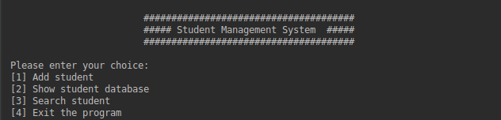
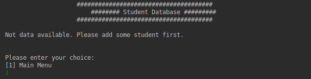
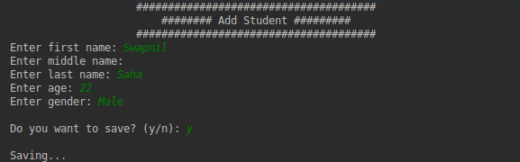
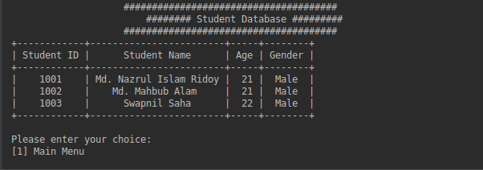

# Student-Management-System

A very basic student management system program written wity Python3. 
Here used prettytable library for managing data and used some built-in python 
libraries like- os, time, system, csv etc for this program. 

## Demo

**Home Interface**

  

**Showing Database while empty**

**Adding new student**

**Showing database**

## Requirements

* `python3 -m pip install -r requirements.txt`

## Features

### April 2018
- [x] Create SMS Program
- [x] Complete add student function
- [x] Add read/write functionality to a csv file
- [x] Complete show student database function

### May 2018
- [ ] Complete search student function
- [ ] Add more necessary feature

## Contributing

Contributions are very welcome, especially adding more features.

If you want to contribute, make sure your code is licensed under the GNU Public User License (like this project). 
Other than that, just open up an issue briefly describing the changes and create a pull request!